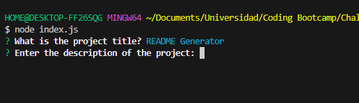
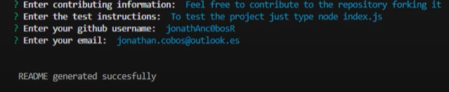

# README Generator 

## Table of contents

- [Description](#description)
- [Installation](#installation)
- [Usage](#usage)
- [Licence](#licence)
- [Questions](#questions)

## Description

Welcome to the README Generator repository. Inside it you will find a node based project that allows you to automatically generate a README.md file thanks to inquirer and npm fs module. 

## Installation

To install the project, clone the repository to your local machine, and install the npm dependencies with npm i. 

## Usage 

After you installed all the necessary stuff, type in the terminal node index.js and a series of questions will prompt via inquirer, answer the questions and the README will be generated. 

## Licence

This repository is licenced under the MIT licence.

# Contact

Have some questions? 

To contact me you can reach me at jonathan.cobos@outlook.es

